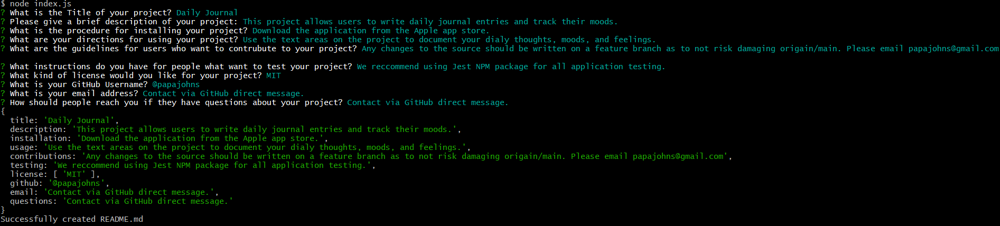

# **Professional-README-Generator**
 
## **Project Description**

This command line interface application will assist you in generating professional README.md files for your projects.

## **How to Use the Project**

Initiate the app by navigating to the file path containing the index.js file and issue the command `node index.js `. From there you'll answer a series prompts that will take and process your information into a README.file, complete with a table of contents and various organized sections.     

## **Installation**

Download the application from the Apple app store.

## **Usage**
  
Use the text areas on the project to document your dialy thoughts, moods, and feelings.
  
## **Testing**

We reccommend using Jest NPM package for all application testing.

## **How to Contribute to this Project**

Suggestions for improving the app functionality and can be DM'd to @josegueraweb. Discussions are welcomed.

## **Contact Information**
  
GitHub: @josegueraweb

## **Questions**
  
Contact via GitHub direct message.